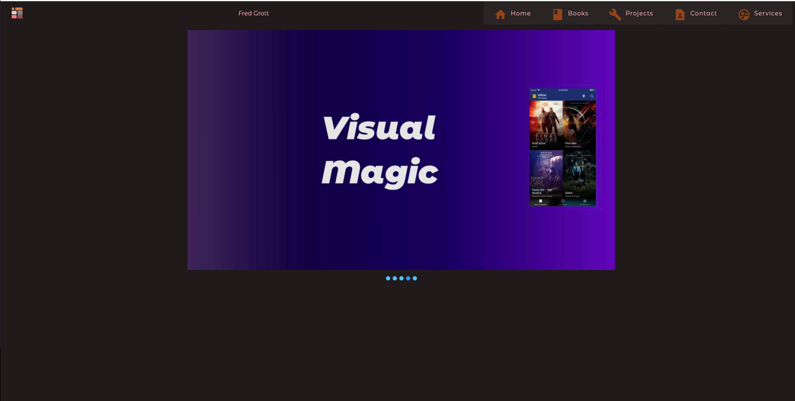
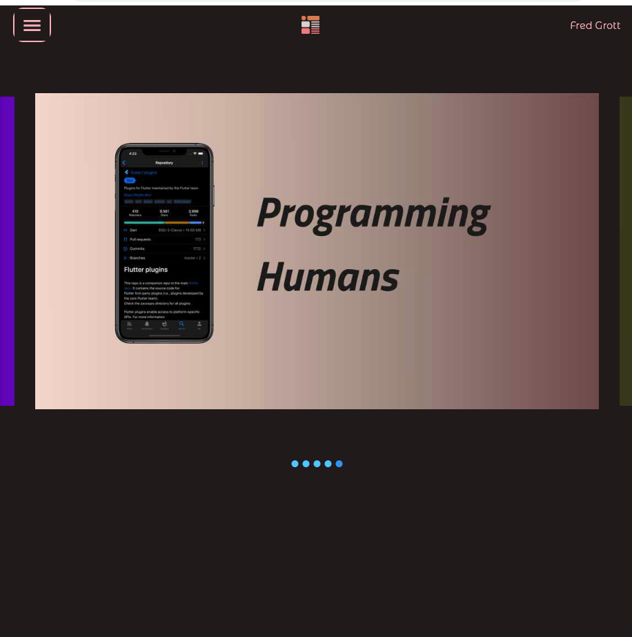

# web_carousel

How to implement a Web Banner the right way in Flutter.

## Screenshots

Desk:

Mobile:

## Medium Article

Here is the Medium Article via the friend free link:

[article](https://fredgrott.medium.com/a-flutter-web-banner-the-right-way-6537f5624307?sk=a86811c87895b51df541fdf96bf29405)

Book stuff is at my GitHub IO website:

[My GitHub IO Website](https://fredgrott.github.io)

## Contact

I tend to use KeyBase as my main conferencing and contact hub, my KeyBase profile url:

[Fred Grott's KeyBase Profile](https://keybase.io/fredgrott)

